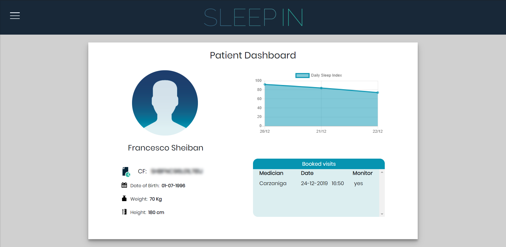
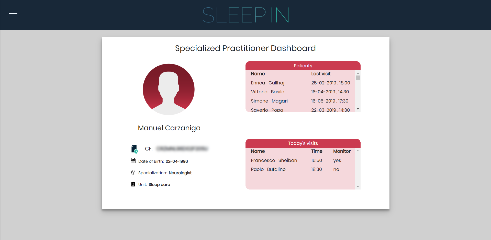
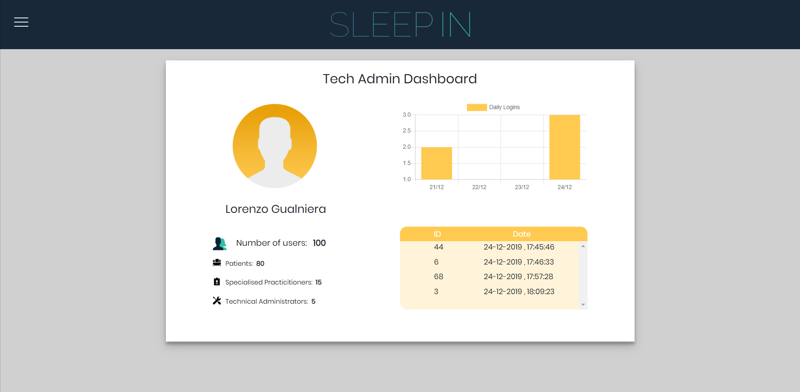
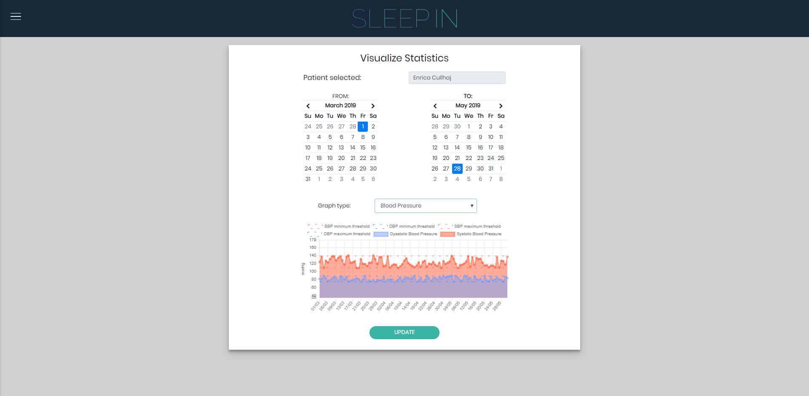
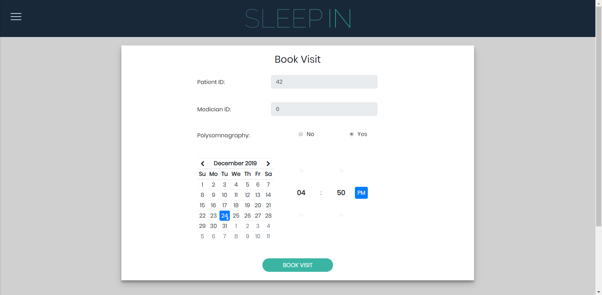
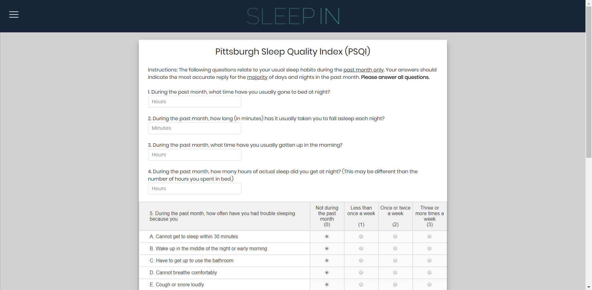
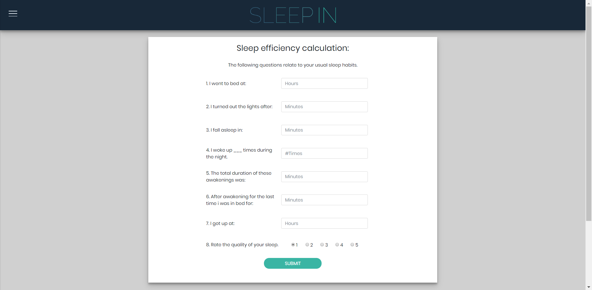

Medical Informatics A.Y. 2018/2019 – II Semester

 

# sleep-in
Online platform for sleep care telemonitoring.

This is a group project assignment from the Medical Informatics course of Politecnico di Milano during the second semester of 2018/2019 academic year.

## Project description
This year project assignment consisted in the developing of "A monitoring system for sleep quality" which was subdivided into the following subgoals:
- Design a database and write a complete report by using UML language to formalize the choices made (the report with use case diagram, class diagram and entity-relashionship diagram can be found in the uml-folder of this repo).
- Implement a [Database Management System](https://en.wikipedia.org/wiki/Database#Database_management_system) (DBMS) for efficient medical data retrieval from the database.
- Develop an application that implements all the functionalities requested by the assignment alongside a [Graphical User Interface](https://en.wikipedia.org/wiki/Graphical_user_interface) (GUI) for an intuitive and easy access to the platform.

For further details about the high level functionalities of the platform please refer to the pdf file of the final presentation which you can find in the repo as well.

## Our implementation
For our implemention, our group had complete freedom of choice regarding the tools and technical details to carry out this project. While doing the entire project by using Microsoft Access was certainly an option (as was the suggested software for this project) we decided to develop a web application from scratch by using Python for both the DBMS and the server framework.

This application has a 3 layer architecture:
1. The lower layer is the database itself which is managed by using the Python module SQLite, responsible for the querying of the tables.
2. The middle layer is the server upon which the web application is built, in this case we chose to use the Python framework flask which is responsible for managing all HTTP requests as well as the cookies needed for handling user sessions.
3. The top layer is the frontend represented by HTML pages that use Jinja to retrieve and send data back to the Flask server. Javascript is also used to make the web pages dynamic.

For setting up the web server on your local machine to try out the demo of this project yourself, please visit the folder project-files where a README.md file will give you intruction on how to proceed.

## Contacts
If you have any issues and/or interest in learning more about the SleepIN platform please don't hesitate to contact us with the contacts listed below:

- manuel.carzaniga@mail.polimi.it
- lorenzo.gualniera@mail.polimi.it
- fosco.cancelliere@mail.polimi.it
- francescojamal.sheiban@mail.polimi.it

## Screenshots

